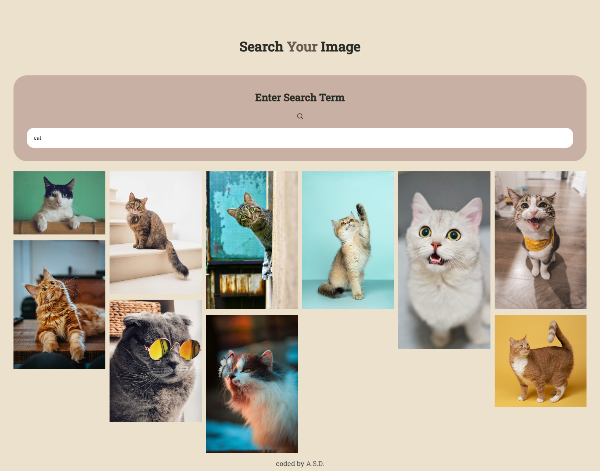

# My First React App - Search Your Image

This is my first app created in React after watching and learning a lot of the topics from the five sections of the course - [Modern React with Redux](https://www.udemy.com/course/react-redux/).
Thanks, Stephan!

## Table of contents

- [Overview](#overview)
  - [Screenshot](#screenshot)
- [My process](#my-process)
  - [Built with](#built-with)
  - [Continued development](#continued-development)

## Overview

Visit: https://asd-u-search-images.netlify.app Find Your Image! :) 

### Screenshot

Desktop:

## My process

### Built with

- React (useState, props)
- Unsplash Image API

### Continued development

- I want to add: creating a list of favorite pictures and the ability to download them.
- Also I want to add some CSS animations.
